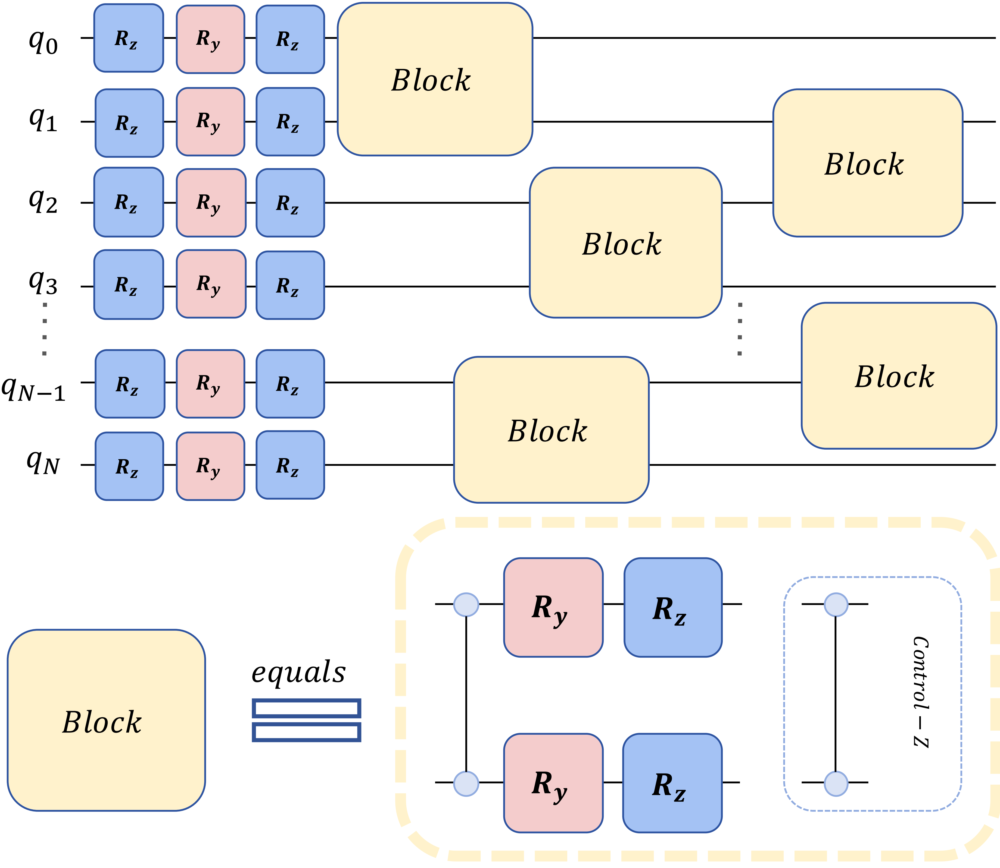
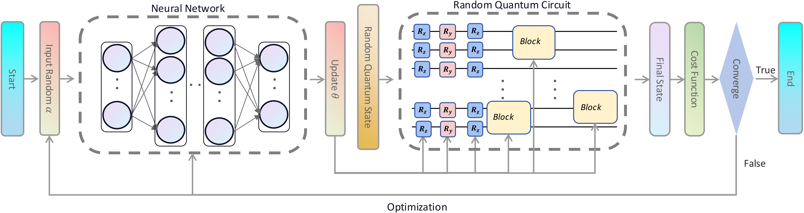
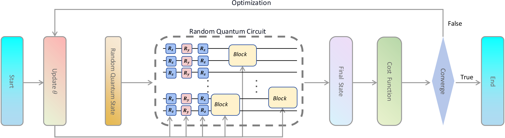

# Title

Investigating the neural network approach for barren plateaus mitigation in variational quantum circuits

## Description

This project explores the potential of classical neural networks to mitigate the barren plateau phenomenon in variational quantum algorithms and evaluates the expressibility of both NEQC and SQC. The novelty of this approach lies in replacing the traditional quantum encoding step with the generation of random quantum states, employing a random method to construct parameterized quantum circuits. In this experiment, we extend neural network techniques to a generalized setting involving random inputs and variational quantum circuit (VQC) structures.

## Methods
#### *1* Random Quantum Circuit
We begin constructing a random circuit by applying a one-qubit unitary operation U to each qubit. This unitary operation can be decomposed as U = Rz(θ1)Ry(θ2)Rz(θ3). Subsequently, we randomly select L pairs of qubits and introduce a block of gates on each pair of qubits. Each block consists of a controlled-Z (CZ) gate connecting the selected qubits, followed by additional Ry and Rz gates on the same qubits. The structures of a VQC and a block are depicted in the next figure. This method of adding blocks is equivalent to alternately adding one CZ gate and one layer of N one-qubit unitary operations on N qubits.

#### *2* Training Porcess
##### *2.1* NEQC 

##### *2.2* SQC

## Plot image
#### 1 plot_loss_landscape
This function generates and visualizes the loss landscape of a model by exploring its loss values in two random directions of the parameter space.

Steps to run:\
1:Function Parameters:
```
model: The NEQC or SQC to analyze.

num_qubits: Number of qubits.

model_name: The name of the model (e.g., 'NEQC-NN').

n: Current training loop.
```
2:What the function does:
```
Flattens all the parameters of the model into a single vector.

Generates two random direction vectors and normalizes them.

Creates a 2D grid by iterating over different values of the two direction vectors.

For each grid point, new parameters are computed by moving along the grid and are applied to the model.

The loss is computed at each point, forming a 2D loss landscape.

The loss landscape is visualized as a 3D surface plot.

Saves the resulting figure in the directory [result/Loss_Landscape]
```
3:Running the code: Call the function with appropriate arguments:
```
plot_loss_landscape(model, num_qubits, model_name, n)
```
The figure will be saved as [{model_name}\_{num_qubits}qubits_{n+1}.pdf] in the [result/Loss_Landscape] directory.
#### 2 plot_avg_iteration_vs_loss
This function visualizes the relationship between average loss and iteration over epochs for various models. It creates a plot showing how the loss changes over time for each model, including an inset graph that focuses on the convergence behavior.

Steps to run:\
1:Function Parameters:
```
loss_value: List or array containing loss values for each iteration.

num_epoch: Number of epochs (iterations).

num_qubits: Number of qubits.

model_list: List of model names ['NEQC-NN', 'NEQC-CNN', 'SQC'].
```
2:What the function does:
```
Computes the average, max, and min losses using compute_average_loss.

Plots the average loss vs. iteration for each model, including shading between the min and maximum loss.

Creates an inset plot focusing on convergence behavior (where the average loss drops below 0.05).

Saves the resulting figure in the directory [result/Avg_loss_vs_epcoh]
```
3:Running the code: Call the function with appropriate arguments:
```
plot_avg_iteration_vs_loss(loss_value, num_epoch, num_qubits, model_list)
```
The figure will be saved as [Avg_loss_vs_epoch_{num_qubits}qubits.pdf] in the [result/Avg_loss_vs_epcoh] directory

## Framworks
The models are constructed and trained using the PyTorch and TensorCircuit frameworks.
```
pip install torch
pip install tensorcircuit
```

## Authors
- [@ZhehaoYi03](https://github.com/PeterYi-del)\
If you have any question, please reach out to me at <a href="mailto:zhehaoyi@163.com">zhehaoyi3@gmail.com</a>

## License

[](https://choosealicense.com/licenses/mit/)